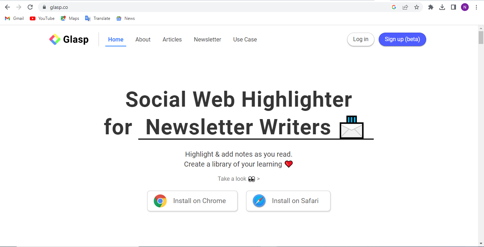

- [User Guide on Glasp; A Web Content Highlighter](#user-guide-on-glasp-a-web-content-highlighter)
- [Introduction](#introduction)
- [Benefits of Using Glasp](#benefits-of-using-glasp)
- [Getting Started with Glasp](#getting-started-with-glasp)
  - [Installing the Extension](#installing-the-extension)
  - [Creating an Account](#creating-an-account)
  - [Choosing Your Favorite Topics](#choosing-your-favorite-topics)
- [Components of the Glasp dashboard](#components-of-the-glasp-dashboard)
  - [The Home Tab](#the-home-tab)
  - [My Highlights](#my-highlights)
  - [The Explore](#the-explore)
- [Things you can do with Glasp](#things-you-can-do-with-glasp)
  - [Highlight Text](#highlight-text)
  - [Add notes to your highlight](#add-notes-to-your-highlight)
  - [Share relevant knowledge to people who share your interests.](#share-relevant-knowledge-to-people-who-share-your-interests)
  - [Finding an Author or any Topic on Glasp](#finding-an-author-or-any-topic-on-glasp)
  - [Sharing your highlight with others](#sharing-your-highlight-with-others)
- [How to make best use of Glasp](#how-to-make-best-use-of-glasp)
- [Conclusion](#conclusion)

# User Guide on Glasp; A Web Content Highlighter

# Introduction

Have you ever been a situation where you want to revisit a web page or an online video without having to serch your browser history looking for them or you want to share an online article with friends but you seem to forget where you saw it. then Glasp can help you to do this and even more.

Glasp is a free web tool that allows users to highlight, save and organize web content while reading articles and washing videos online. it is a user friendly tool that also help you to add note to your highlighted documents and also grant you easy access to these documents anytime.

This user guide provide you with a detailed information on how to start using glasp and its benefits.

# Benefits of Using Glasp

1. You can save time by quickly finding and revisiting important content without having to search through your browsing history or bookmarks.
2. Glasp makes it simple to share stored content with others. You can find other users' highlights by searching for specific tags on any topic you want. also, you can look up a specific author to view all of their best work.
3. You can highlight important passages in articles and movies and add comments to help you remember important details.
4. Glasp makes it easy to highlight, organize and save web content in one place making it simple to find and access later.

# Getting Started with Glasp

Folow these procedures to install the browser and then create an account:

## Installing the Extension

1. Click the highlighted text to navigete to [Glasp](https://glasp.co/home) website.
2. You can either choose between ( Install on Chrome or install on Safari ) to add glasp extension after which you click the install button
3. Click on Add to Chrome to install the extension
   
4. After you are done with the installation, you will be directed to the home page where you will creat an account to begin using Glasp

## Creating an Account

1. From your browser's extension click on the Glasp icon
2. Click on the " Log In/Sign up(beta)" buttton on top of the Glasp dashboard
   

3. Click on "Continue with Google" to sign up with a google account
4. 
5. Chose a google account to sign up with
6. A popup will appear on the right side of your browser, Click on the Home icon

## Choosing Your Favorite Topics

1. You will be presented with a box with topics to follow which will then be used to personalise your page
2. Select between 1 - 10 topic and click "Save"
3. 
4. You will be taken to your dashboard

# Components of the Glasp dashboard

After selecting your prefared topic, you will be taken to your dashboard which provides you will a nice user-friendly interface which is easy to navigate. It's made up of three tabs

## The Home Tab

It's provides you with recommendations on who to follow, and you can see recommendtion based on the prefared topic you selaected.

## My Highlights

This page displays your profile, you can access all your personal information from this tab. My highlight's tab displays a chart that monitor your highlights from from when they are created.

## The Explore

You can search for more highlights from the larger community by searching for topics, authors, or websites.

# Things you can do with Glasp

## Highlight Text

Glasp enables you to highlight and extract only important parts of a text or topic, save and use them for a later time. To highlight, follow these procedure:

1. Go to the web page you want to highlight.
2. Select the text you want to highlight with your mouse.
3. A popup menu will appear.

From the popup menu, a color pallet will appear, you can select a color from the list of colors to highlight your text.

## Add notes to your highlight

Glasp makes it easy to add note to your highlighted text on the same web page

1. On the highlighted webpage, click on the extension menu to locate the Glasp icon and locate the highlights you want to add note to.
2. Click the "Add a note" button when your cursor is above a certain highlight, or click the three dots and choose "Add a note."
   

## Share relevant knowledge to people who share your interests.

You can find people who share similar interest with your topics, and who also want to connect with individuals with the same interest.

1. On the Glasp dashboard, click on your profile picture at top right of the page.
2. Click on “Find like minds”.
   
3. You can select to find like-minded people with either Articles or Kindles. If you choose Articles, people who have highlighted the same articles will be presented to you. If you choose Kindles, people who read same books as you on Kindle will be revealed.

## Finding an Author or any Topic on Glasp

1. On the Home Page, click on the search bar.
2. Enter any author name or topic you want to search.
   

## Sharing your highlight with others

1. Go to the your dashboard, click on the “My Highlights” tab.
2. Select the webpage of the particular highlight you want to share.
3. In the Detailed View component, click on the “Share” option.
4. You can either choose if you want to share ia link, email, or social media.
5. Enter the recipient email and message body if you wish to send via email.
6. if you wish to share your highlight via link or social media, copy the link or share it directly to your social media account

# How to make best use of Glasp

Glasp is a flexible solution for managing and distributing your web content. To ensure you make the most of the tool, follow these recommended practices:

1. Apply tags: Create categories for your highlights and bookmarked web sites using descriptive tags to make it simpler to identify them later.
2. Observe knowledgeable people: Follow people who are knowledgeable on topics you want to learn more about or who have similar interests to yours. As a result, you'll be able to take inspiration from their greatest accomplishments.
   Partner with others: Glasp facilitates teamwork when creating web content.
3. Review your highlights: Make time to go over your highlights on a frequent basis to help you retain the information and to reinforce your understanding of the material.

# Conclusion

you can see how the Glasp provides you with a user friendly web tools that makes it possible to create and organize your thought in a page and make it accessible to other who also share similar interest. You can start using the Glasp by [signing up now](https://glasp.co/home)
